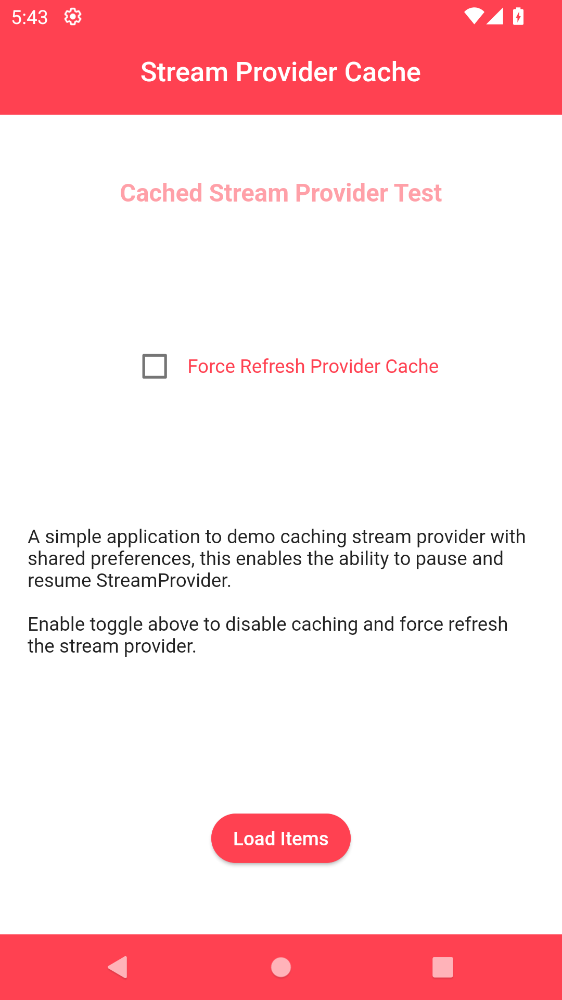
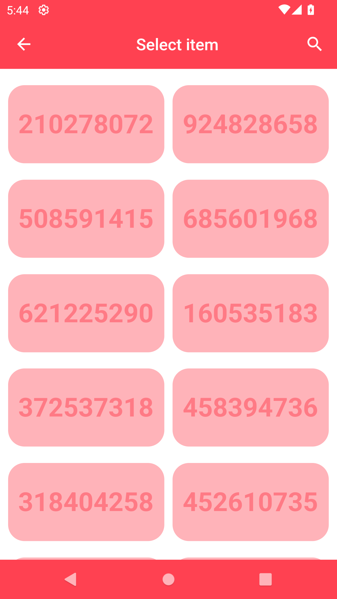

# stream_provider_cache

A simple flutter application to demonstrate the use of StreamProvider with
SharedPreferences for caching provider values.

## Features

- Stream Provider caching.
- ability to trigger a refresh with a shared preference key.
- generic methods to access and update providers.
- generic methods to access and update shared preferences.

## Caching Process

- fetch provider value from cache.
- start adding new items from last cached item.
- if no cached items, start adding new items from the beginning.
- cache items in shared preferences.
- filter items according to search provider value.
- return list of items filtered.

## Considerations

the data model that needs to be cached must implement:

- `Map<String, dynamic> toJson();`
- `Object.fromJson(Map<String, dynamic> json);`

when using provider families with multiple arguments, the model used as provider
arguments needs to implement:

- `bool operator ==(Object other)` operator method.
- `int hasCode()` method

for riverpod to be able to differentiate between provider instances, check
`GridItemsProviderArgs` implementation in
[grid_item.dart](./lib/src/models/grid_item.dart) file.

## Dependencies

- flutter_riverpod
- shared_preference
- easy_search_bar

## Directory Structure

```bash
lib
└── src
    ├── models
    ├── pages
    ├── services
    ├── utils
    └── widgets
```

## Previews

|                                           |                                           |                                           |
| :---------------------------------------: | :---------------------------------------: | :---------------------------------------: |
|  Home Page |  Grid Page |  Item Page |
